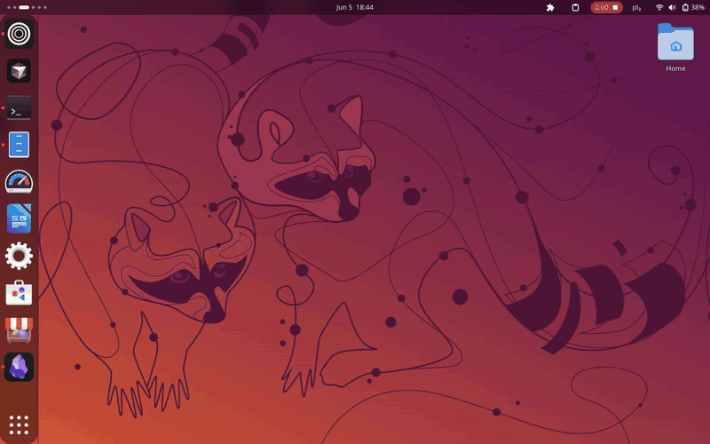

# GroqType

<p align="center">
  <strong>Hold a key. Speak. Text appears — in any app, anywhere on your desktop.</strong>
</p>

<p align="center">
  System-wide speech-to-text for Linux, powered by Groq Whisper.
</p>

---

<p align="center">
  
</p>

<p align="center">
  <a href="docs/captures/groqtype-demo.webm"><strong>▶ Watch full video</strong></a> (WebM)
</p>

---

## Why GroqType?

Most dictation tools live inside one app — a browser tab, a notes window, a proprietary desktop client. GroqType works at the **OS level**:

| Problem with other tools | How GroqType solves it |
|--------------------------|------------------------|
| Tied to a single application | Types or pastes into **whatever has focus** |
| Cloud tools need copy-paste gymnastics | Hold-to-talk → text lands directly in your editor |
| Electron apps are heavy and closed | Small Python daemon + your existing Linux stack |
| Per-app integrations don't scale | One global hotkey for your entire session |

**Use cases:** coding in your IDE, writing emails, filling forms, taking notes in a terminal, chatting — anywhere you already type.

---

## Quick start

**Requirements:** Linux (Wayland or X11), Python 3.10+, [Groq API key](https://console.groq.com/keys)

```bash
git clone https://github.com/dixonSolutions/GroqType.git
cd GroqType

# 1. System packages + Python venv
./scripts/install-deps.sh

# 2. Interactive setup (API key, shortcut, systemd, CLI)
./scripts/install.sh
```

Non-interactive install:

```bash
GROQ_API_KEY='gsk_your_key' ./scripts/install.sh --quick
```

Hold **Caps Lock** (default), speak, release. Text appears in the focused window.

Check it's running:

```bash
sudo systemctl status groqtype    # system service (default)
./scripts/doctor.sh --check         # full health check
```

---

## How it works (30 seconds)

```
Caps Lock  →  keyd  →  groqtype daemon  →  Groq Whisper  →  ydotool / clipboard  →  your app
```

1. **keyd** remaps your physical shortcut to a virtual hotkey.
2. The **daemon** records audio while you hold the key.
3. Audio goes to **Groq Whisper** for transcription.
4. Text is **typed or pasted** into the focused window via `ydotool` and `wl-clipboard`.

Deeper dive → [docs/architecture.md](docs/architecture.md)

---

## Configuration

```bash
./scripts/config.sh show                    # view settings (secrets masked)
./scripts/config.sh set transcribe-mode stream   # live streaming mode
./scripts/config.sh set api-key gsk_...     # update API key
./scripts/config.sh restart                 # restart service
```

Or via CLI:

```bash
groqtype config-show
groqtype shortcut set capslock
groqtype config transcribe-mode stream
```

Full reference → [docs/configuration.md](docs/configuration.md)

---

## Scripts

| Script | Purpose |
|--------|---------|
| [`install-deps.sh`](scripts/install-deps.sh) | Install OS packages and Python venv |
| [`install.sh`](scripts/install.sh) | Full interactive setup |
| [`config.sh`](scripts/config.sh) | Manage settings and secrets |
| [`doctor.sh`](scripts/doctor.sh) | Diagnose and repair |

```bash
./scripts/doctor.sh --check   # report only
./scripts/doctor.sh --fix     # auto-fix common issues
```

---

## Supported distros

Dependency install supports **apt** (Debian/Ubuntu), **dnf** (Fedora), **pacman** (Arch), and **zypper** (openSUSE).

---

## Documentation

| Doc | Description |
|-----|-------------|
| [docs/](docs/) | Documentation index |
| [Architecture](docs/architecture.md) | Layered system design |
| [Configuration](docs/configuration.md) | Settings, secrets, services |
| [Development](docs/development.md) | Code layout and contributor workflow |

---

## Contributing

Contributions are welcome — including from first-time open-source contributors.

Read [CONTRIBUTING.md](CONTRIBUTING.md) for how to get started. A good first step is running `./scripts/doctor.sh --check` on your machine and reporting what you find.

---

## License

See repository license file. If none is present yet, check with the maintainers before redistributing.
