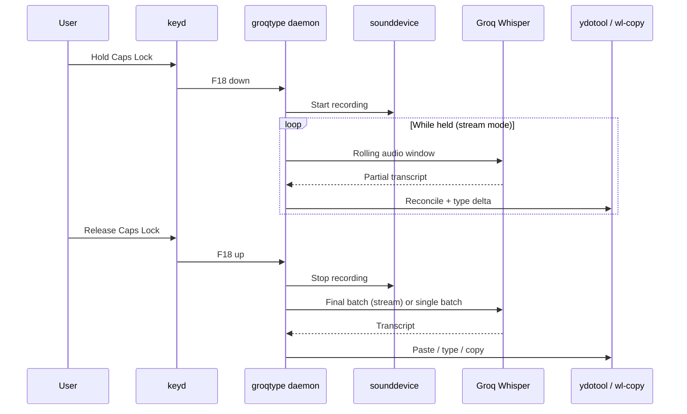

# Architecture

GroqType is a **system-wide speech-to-text daemon** for Linux. You hold a key, speak, and transcribed text appears in whatever app has focus — no browser tab, no clipboard juggling, no per-app integration.

This document describes the system in layers, from what you experience down to how the pieces connect.

---

## Layer 1 — User experience

```
Hold Caps Lock → speak → release → text appears in your editor
```

1. You press and hold your configured shortcut (default: **Caps Lock**).
2. GroqType records audio from your microphone.
3. On release, audio is sent to a transcription provider (Groq Whisper by default).
4. The result is delivered into the focused window — by typing (`ydotool`), pasting (`wl-copy` + Ctrl+V), or copying only.

In **stream mode**, partial transcripts appear while you are still holding the key. The daemon reconciles rolling hypotheses so text updates in place instead of repeating.

---

## Layer 2 — Services and process model

```
┌─────────────────────────────────────────────────────────────┐
│  systemd service (groqtype.service)                         │
│  runs: groqtype.py daemon                                   │
│  listens: keyd monitor → virtual hotkey (e.g. F18)          │
└─────────────────────────────────────────────────────────────┘
```

| Component | Role |
|-----------|------|
| **systemd** | Keeps the daemon running, restarts on failure, injects session env (display, audio, API key) |
| **groqtype.py daemon** | Main loop: watch hotkey, record audio, transcribe, output text |
| **keyd** | Remaps a physical key (Caps Lock) to a virtual hotkey the daemon watches |
| **ydotool** | Simulates keyboard input system-wide (Wayland-friendly) |
| **wl-clipboard** | Copies text to the Wayland clipboard for paste mode |

**Important:** Only **one** groqtype service (system *or* user) should run at a time. Two daemons on the same hotkey will duplicate output.

---

## Layer 3 — Hotkey pipeline

```
Physical key          keyd                 Daemon
─────────────         ────                 ──────
Caps Lock      →      F18 (virtual)   →    keyd monitor detects down/up
```

1. **shortcut_key** (e.g. `capslock`) — the key you physically hold.
2. **keyd** writes `/etc/keyd/groqtype.conf` mapping that key → **hotkey** (e.g. `f18`).
3. The daemon runs `keyd monitor` and reacts to `f18` press/release events.

Changing the shortcut updates both `config.json` and keyd, then restarts keyd + groqtype.

---

## Layer 4 — Audio and transcription

```
Microphone → sounddevice → audio buffer → provider API → text
```

### Batch mode (default)

1. Record while hotkey is held.
2. On release, concatenate frames → WAV file.
3. Call `transcribe_batch()` once.
4. Output full result.

### Stream mode

1. Record while hotkey is held.
2. Every `stream_step_sec` (default 0.7s), take the last `stream_window_sec` (default 6s) of audio.
3. Call `transcribe_stream()` on that window.
4. **Reconcile** new words against what was already typed (suffix/prefix overlap matching).
5. Backspace stale tail, type the corrected hypothesis.
6. On release, run a final batch pass to polish the result.

Config is **reloaded at the start of each recording**, so mode changes apply on the next hotkey press without a full restart.

---

## Layer 5 — Output delivery

| `output_mode` | Behavior |
|---------------|----------|
| `paste` | `wl-copy` → simulate Ctrl+V via ydotool |
| `type` | `ydotool type <text>` character by character |
| `copy` | Clipboard only, no auto-insert |

Stream mode always uses ydotool typing with reconciliation, regardless of `output_mode` during live updates. Final behavior on release follows the configured mode where applicable.

---

## Layer 6 — Provider abstraction

```
providers/
├── base.py          # BaseProvider interface
├── groq.py          # Groq Whisper API (implemented)
├── elevenlabs.py    # Stub for future provider
└── registry.py      # get_provider(name, api_key)
```

Each provider implements:

- `transcribe_batch(audio_path, model, language)` — full-file transcription
- `transcribe_stream(audio_data, model, language)` — rolling-window transcription

Adding a provider means: new class → register in `registry.py` → set `provider` in config.

---

## Layer 7 — Configuration and tooling

| Store | Path | Used by |
|-------|------|---------|
| User config | `~/.config/groqtype/config.json` | CLI, user systemd service |
| System config | `/etc/groqtype/config.json` | System systemd service (`GROQTYPE_CONFIG`) |
| keyd bindings | `/etc/keyd/groqtype.conf` | keyd daemon |
| systemd unit | `/etc/systemd/system/groqtype.service` or `~/.config/systemd/user/` | Service manager |

### Scripts

| Script | Purpose |
|--------|---------|
| `install-deps.sh` | OS packages + Python venv |
| `install.sh` | Interactive full setup |
| `config.sh` | View/edit settings and secrets |
| `doctor.sh` | Diagnose and repair |

### CLI (`groqtype`)

```bash
groqtype daemon              # run foreground (normally via systemd)
groqtype config-show         # print config (API key masked)
groqtype config <key> <val>  # set a value
groqtype shortcut set/show   # manage keyd shortcut
```

---

## Layer 8 — Data flow (end to end)



---

## File map

```
GroqType/
├── groqtype.py           # Daemon, CLI, recording, reconciliation
├── keyd_shortcut.py      # keyd config read/write/apply
├── providers/            # Transcription backends
├── scripts/
│   ├── install-lib.sh    # Shared install/config helpers
│   ├── install-deps.sh
│   ├── install.sh
│   ├── config.sh
│   └── doctor.sh
└── docs/                 # You are here
```
